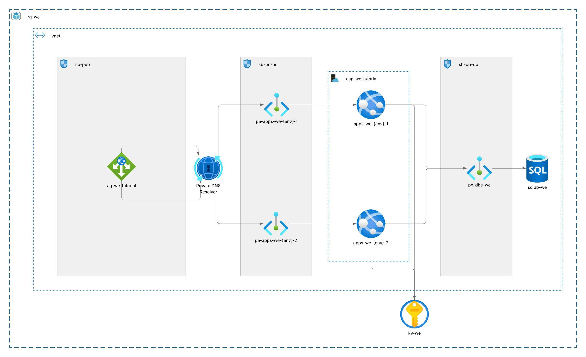

# ✅ Solution

This solution is implemented for the AI generated challange for self development purposes. The Assignment can be found in Assignment.md file.

## ▶️ Execution

In the main directory, there are 2 folders which are azuread and azurerm. The execution should start with azuread folder in order to create "project admins user group" later to be used as database admins in database creation.

### 👣 Steps

#### Execution of azuread

1. Uncomment azuread/variables.tf 3rd line and put your users object_id

2. Login to authorize your local environment
    az login

3. Change directory
    cd azuread

4. Initialize Terraform and Execute it
    terraform init
    terraform apply 
        -> type "yes" to confirm execution

#### Execution of azurerm

1. if you haven't logged in, login to authorize your local environment
    az login

3. Change directory
    cd azurerm

4. Initialize Terraform and Execute it
    terraform init
    terraform apply 
        -> Provide environment key ("d","t","a","p")
        -> type "yes" to confirm execution

#### Check Following

- After the resources are created, navigate to your Application Gateway resource to copy the public IP created. This IP must be accessible from the internet. You can test it on your browser.

- Check the default hostnames of the App Services from their overview page. Those links should give 403 and be inaccesable from public.

### ⚠️ Don't forget to destroy the resources, this will avoid unexpected costs ⚠️

## Architecture Diagram

## Next Steps - More to do

- Using GitHub actions
IaC code in Terraform is delivered for local execution, using GitHub actions will provide an automation and reduce human error risk.

- Remote State
For the teams to work together, using remote state will help simultanous executions by different engineers.

- Database Access from the User Group
Database is supposed to be accessable by a certain user group members. Although the implementation has been done, it is not yet tested.

- SSL termination
SSL termination of the assignment has not yet been implemented. Thus the app services have their "HTTPS only = false" and the security will be increased